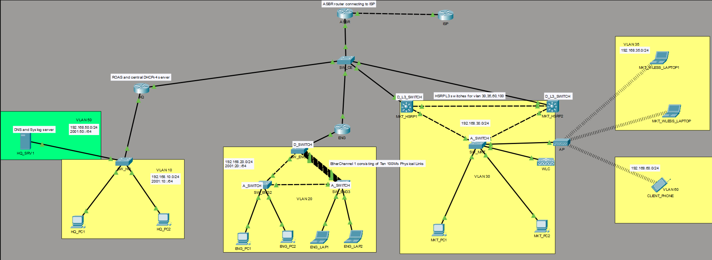
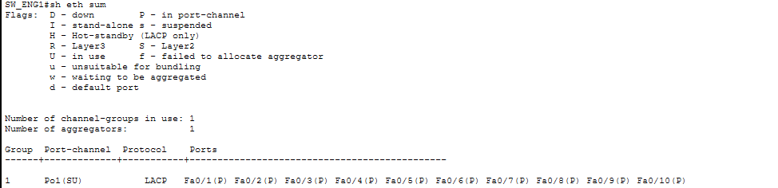
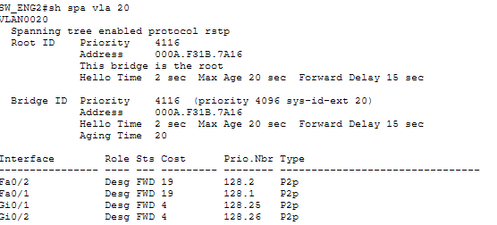
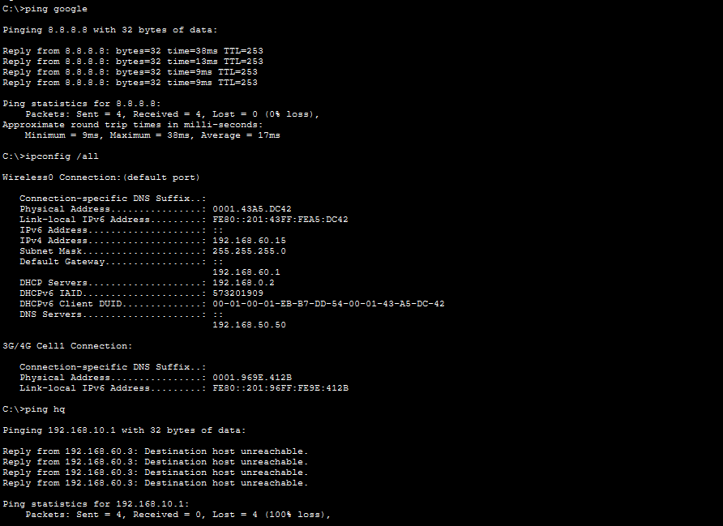
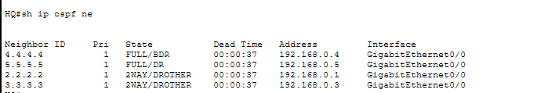

# Enterprise Campus Network Lab

## Overview

This project is a simulated enterprise campus network built in Cisco Packet Tracer. The topology was designed to demonstrate enterprise-style routing, switching, wireless infrastructure, redundancy, Layer 2 security, IPv6 integration, and centralized network management services.

The lab implements a multi-department architecture consisting of Headquarters (HQ), Engineering (ENG), and Marketing (MKT) departments connected through a centralized aggregation/core layer and routed WAN edge.

The project focuses not only on configuration but also on troubleshooting protocol interactions, redundancy behavior, and operational network management.

---

## Network Topology

---

## Topology Summary

### Departments and VLANs

| Department         | VLAN     | Subnet           |
| ------------------ | -------- | ---------------- |
| HQ                 | VLAN 10  | 192.168.10.0/24  |
| Engineering        | VLAN 20  | 192.168.20.0/24  |
| Marketing          | VLAN 30  | 192.168.30.0/24  |
| Wireless Corporate | VLAN 35  | 192.168.35.0/24  |
| Servers            | VLAN 50  | 192.168.50.0/24  |
| Wireless Guest     | VLAN 60  | 192.168.60.0/24  |
| WLC Management     | VLAN 100 | 192.168.100.0/24 |

IPv6 dual-stack addressing was also implemented across major VLANs using /64 prefixes.

---

## Network Architecture

The topology follows a small enterprise collapsed-core design.

### Core / Aggregation Layer

* SW_CE aggregation switch
* ASBR edge router
* ISP simulation router

### Distribution Layer

* Dual multilayer switches for Marketing department redundancy
* HSRP implementation for gateway redundancy

### Access Layer

* Access switches for HQ and Engineering
* EtherChannel deployment in Engineering
* STP redundant topology

### Wireless Infrastructure

* Cisco WLC-3504 Wireless LAN Controller
* Lightweight Access Point
* Separate corporate and guest wireless VLANs
* Dedicated WLC management VLAN

---

## Implemented Technologies

### Routing

* OSPFv2
* OSPFv3 (IPv6)
* Static routing
* Floating static routes
* Default route propagation

### Switching

* VLAN segmentation
* Inter-VLAN routing
* Rapid Spanning Tree Protocol (RSTP)
* EtherChannel using LACP
* HSRP gateway redundancy

### Security

* ACL-based segmentation
* Guest network isolation
* Port Security
* DHCP Snooping
* Dynamic ARP Inspection (DAI)
* BPDU Guard
* PortFast

### Wireless

* Lightweight AP deployment
* WLC-managed WLANs
* Guest wireless segmentation

### Management and Monitoring

* SSH remote management
* SNMP monitoring
* Syslog centralized logging
* NTP time synchronization

### WAN Edge

* NAT/PAT configuration
* ASBR edge routing toward ISP

---

## Key Features

### HSRP Redundancy

Marketing department gateways are protected using HSRP with active/standby multilayer switches to provide gateway failover.

---

### EtherChannel Aggregation

Engineering switches use LACP EtherChannel bundling to increase bandwidth and provide link redundancy.

---

### STP Redundancy

RSTP was implemented to prevent Layer 2 loops while maintaining redundant topology paths.

---

### Wireless Guest Isolation

Guest wireless clients are isolated from internal corporate VLANs using ACL policies.

---

### Dynamic Routing with OSPF

OSPF was implemented for internal route propagation across routers and multilayer switches.

---

### Centralized Management

Network devices send logs to a centralized Syslog server and synchronize time using NTP.

---

## Troubleshooting Challenges and Resolutions

### 1. HSRP and STP Alignment

#### Issue

Traffic forwarding paths became suboptimal when HSRP active gateways and STP root bridges were misaligned.

#### Resolution

STP root placement was aligned with active HSRP gateways to optimize Layer 2 forwarding paths and reduce unnecessary traffic traversal.

---

### 2. DHCP Snooping and STP Interaction

#### Issue

DHCP client failures occurred after changing STP root bridge placement in the Engineering topology.

#### Cause

Even after applying `ip dhcp snooping trust` to the physical member interfaces, DHCP traffic still failed because once an EtherChannel is formed, Packet Tracer effectively treats the logical Port-Channel as the active forwarding interface and ignores configuration changes made directly to the bundled physical links for DHCP Snooping behavior. Since Packet Tracer does not support DHCP Snooping trust configuration on logical EtherChannel interfaces, this created a limitation where DHCP OFFER messages from the centralized DHCP server could not traverse the topology correctly.

#### Resolution

Two possible workarounds were identified: either avoid using EtherChannel and rely on direct physical interfaces where DHCP Snooping trust could be applied successfully, or keep the EtherChannel deployment and manipulate STP root bridge placement so the Port-Channel remained in an alternate state while another trusted path carried the DHCP traffic. The second approach was used in this lab, and the Packet Tracer limitation regarding DHCP Snooping on logical Port-Channel interfaces was documented.

---

### 3. ACL Persistence Issues on Multilayer Switches

#### Issue

ACLs applied to SVIs on the multilayer switches occasionally disappeared after reopening the Packet Tracer topology, even though the running configuration had previously been saved to startup configuration using `copy running-config startup-config`.

This behavior primarily affected ACLs used for guest VLAN isolation on the HSRP-enabled multilayer switches.

#### Cause

This appeared to be a Packet Tracer persistence limitation affecting multilayer switch runtime configuration restoration. In several cases, the ACL statements remained present in the startup configuration but were no longer applied to the active SVI interfaces after reopening the `.pkt` file.

#### Resolution

The ACLs were manually reapplied to the affected VLAN interfaces after reopening the topology. The issue was identified as a Packet Tracer simulator inconsistency rather than an IOS configuration problem, and the behavior was documented as part of the lab troubleshooting process.

---

### 4. Limited IPv6 DHCP Functionality

#### Issue

The multilayer switches used in the topology did not fully support DHCPv6 services within Packet Tracer, limiting the ability to implement complete stateful IPv6 address assignment across the network.

#### Resolution

Due to these platform limitations, only partial IPv6 functionality was implemented. SLAAC-based addressing and basic IPv6 connectivity were demonstrated, while full DHCPv6 deployment was not used throughout the topology.

---

### 5. Wireless WLAN and SSID Broadcasting Issues

#### Issue

Wireless SSIDs were not consistently being broadcast by the lightweight access point during WLC deployment testing. This appeared to be related to Packet Tracer limitations and inconsistent controller behavior rather than a configuration error.

#### Resolution

FlexConnect mode was configured through the Wireless LAN Controller (WLC). To resolve the SSID broadcasting issue, both FlexConnect Local Switching and FlexConnect Local Authentication were enabled on the respective WLANs within the WLC. This allowed the SSIDs to broadcast correctly and enabled wireless clients to properly associate with the configured WLANs. Wireless VLAN trunking and WLAN-to-VLAN mappings were also verified to ensure traffic was correctly bridged into the intended VLANs.

---

## Verification and Testing

The following functionality was verified successfully:

* OSPF neighbor formation
* HSRP failover
* EtherChannel operation
* STP loop prevention
* NAT/PAT internet access
* SSH remote login
* Syslog message generation
* NTP synchronization
* Wireless client connectivity
* ACL-based guest isolation
* DHCP Snooping operation
* IPv6 reachability

---

## Files Included

* Packet Tracer topology (.pkt)
* Device configurations
* Network screenshots
* Troubleshooting notes
* Final topology diagram

---

## Technologies Used

* Cisco Packet Tracer
* Cisco IOS
* IPv4 / IPv6
* OSPF
* HSRP
* RSTP
* EtherChannel (LACP)
* DHCP Snooping
* SNMP
* Syslog
* NTP
* Wireless LAN Controller (WLC)

---

## Future Improvements

Potential future expansions include:

* Migration to GNS3/EVE-NG
* BGP edge routing
* Network automation using Python
* Linux-based monitoring stack
* Dockerized services
* NetFlow monitoring
* AAA authentication using TACACS+/RADIUS
